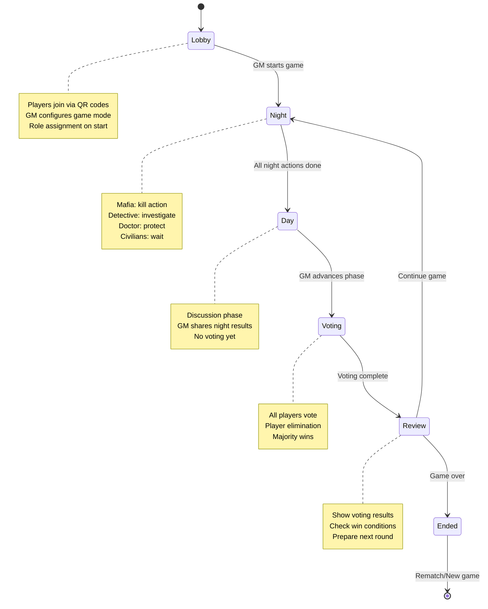

# Mafia Game - Architektura techniczna

## 🎯 Przegląd architektury

Mafia Game Helper wykorzystuje nowoczesną architekturę serverless opartą na Next.js 15 z App Router i Cloudflare Edge Runtime.

### Stack techniczny
- **Frontend**: Next.js 15 + React 19 + Tailwind CSS v4
- **Backend**: Next.js API Routes na Cloudflare Workers (Edge Runtime)
- **Database**: Cloudflare D1 (SQLite na edge)
- **State Management**: Zustand + React hooks + polling
- **Build**: @cloudflare/next-on-pages
- **Types**: Full TypeScript coverage

## 🔄 Diagram przepływu gry



## 🏗 Architektura komponentów

### Frontend Architecture

```
app/src/
├── app/                          # Next.js App Router
│   ├── page.tsx                  # Landing page (join/create)
│   ├── layout.tsx                # Root layout
│   ├── game/[token]/
│   │   ├── page.tsx              # Game wrapper
│   │   └── GameClient.tsx        # Main game component
│   └── api/game/                 # API routes
├── lib/                          # Core business logic
│   ├── db.ts                     # Database operations
│   ├── store.ts                  # In-memory store
│   └── missions-presets.ts       # Mission data
└── stores/                       # Client state
    └── gameStore.ts              # Zustand store
```

### Kluczowe komponenty

#### 1. GameClient.tsx (~1000 lines)
**Główny komponent gry** - obsługuje całą logikę UI dla wszystkich faz gry.

```typescript
// Key responsibilities:
- Real-time polling (2s interval)
- Phase-specific UI rendering
- Action submission (vote, night actions)
- Role-based view filtering
- GM panel for game control
- Mission management UI
```

**Stan lokalny:**
- `gameState`: Aktualny stan gry z serwera
- `selectedTarget`: Cel akcji nocnej/głosowania
- `isSubmitting`: Loading states
- `showRoles`: Toggle dla GM view

#### 2. lib/db.ts (~1250 lines)
**Core database logic** - wszystkie operacje na D1 database.

**Kluczowe funkcje:**
- `createGame()`: Tworzenie nowej gry z unikalnym kodem
- `joinGame()`: Dołączanie gracza do gry
- `startGame()`: Przypisywanie ról i start gry
- `submitAction()`: Obsługa akcji nocnych i głosowania
- `advancePhase()`: Logika przejść między fazami
- `buildRoles()`: Algorytm przypisywania ról

**Design patterns:**
- Async/await z error handling
- Transaction-like operations przez D1 batch
- Type-safe query builders
- Validation na poziomie funkcji

#### 3. lib/store.ts (~300 lines)
**In-memory fallback store** - używany gdy D1 nie jest dostępne (dev).

**Implementacja:**
- Map-based storage dla szybkości
- Identyczna API jak db.ts
- Automatyczne przełączanie w runtime

#### 4. stores/gameStore.ts
**Client-side state** - Zustand store z persistence.

```typescript
interface GameStore {
  nickname: string;           // Persisted nickname
  setNickname: (name: string) => void;
  gameState: GameStateResponse | null;  // Current game state
  setGameState: (state: GameStateResponse | null) => void;
}
```

## 🔌 API Architecture

### Endpoint Structure

```
/api/game/
├── create              POST  # Create new game
├── join                POST  # Join existing game
└── [token]/
    ├── state           GET   # Get game state
    ├── start           POST  # Start game (GM only)
    ├── phase           POST  # Advance phase (GM only)
    ├── action          POST  # Submit action (vote/night)
    ├── finalize        POST  # End game
    ├── rename          POST  # Change player name
    ├── message         POST  # Send message (GM only)
    ├── kick            POST  # Kick player (GM only)
    ├── transfer-gm     POST  # Transfer GM rights
    ├── rematch         POST  # Create new game
    └── mission/
        ├── [route]     POST  # Create mission
        └── [id]/
            ├── [route] DELETE # Delete mission
            └── complete POST  # Complete mission
```

### Request/Response Patterns

**Standard Response Format:**
```typescript
interface ApiResponse<T = unknown> {
  success: boolean;
  data?: T;
  error?: string;
}
```

**Game State Response:**
```typescript
interface GameStateResponse {
  game: {
    id: string;
    code: string;
    status: 'lobby' | 'playing' | 'finished';
    phase: 'lobby' | 'night' | 'day' | 'voting' | 'review' | 'ended';
    round: number;
    winner?: 'mafia' | 'town';
    config: GameConfig;
  };
  player: {
    token: string;
    nickname: string;
    role?: Role;
    isAlive: boolean;
    isHost: boolean;
  };
  players: PublicPlayer[];  // Filtrowane według roli
  messages: Message[];
  missions: Mission[];
  actions?: ActionSummary;  // Tylko dla GM
}
```

### Authentication & Authorization

**Token-based access:**
- Każdy gracz otrzymuje unikalny token przy join
- Token jest używany we wszystkich API calls
- GM permissions sprawdzane na poziomie DB

**Security considerations:**
- Tokens są UUID v4 (crypto-secure)
- Game codes są 6-znakowe (A-Z, collision-resistant)
- Rate limiting przez Cloudflare
- Input validation na wszystkich endpointach

## 💾 Database Schema Design

### Entity Relationship

```
┌─────────────┐    ┌─────────────┐    ┌─────────────┐
│   players   │    │    games    │    │game_players │
│             │    │             │    │             │
│ id (PK)     │────│host_player_id│    │ game_id (FK)│
│ nickname    │    │ code        │    │ player_id   │
│ total_pts   │    │ status      │    │ token (UK)  │
│ games_won   │    │ phase       │    │ nickname    │
│ created_at  │    │ round       │    │ role        │
│             │    │ winner      │    │ is_alive    │
│             │    │ config      │    │ is_host     │
└─────────────┘    └─────────────┘    └─────────────┘
                                            │
        ┌───────────────┬───────────────────┼────────────────┐
        │               │                   │                │
┌─────────────┐ ┌─────────────┐ ┌─────────────┐ ┌─────────────┐
│  messages   │ │ game_actions│ │  missions   │ │   indexes   │
│             │ │             │ │             │ │             │
│ id (PK)     │ │ id (PK)     │ │ id (PK)     │ │ games.code  │
│ game_id (FK)│ │ game_id (FK)│ │ game_id (FK)│ │ gp.token    │
│ from_player │ │ round       │ │ player_id   │ │ gp.game_id  │
│ to_player   │ │ phase       │ │ description │ │ msg.game_id │
│ content     │ │ player_id   │ │ is_secret   │ │ act.game_rd │
│ is_read     │ │ action_type │ │ is_complete │ │ mis.game_pl │
│ created_at  │ │ target_id   │ │ points      │ │             │
└─────────────┘ └─────────────┘ └─────────────┘ └─────────────┘
```

### Table Details

#### `games` table
```sql
CREATE TABLE games (
  id             TEXT PRIMARY KEY,     -- UUID
  code           TEXT NOT NULL UNIQUE, -- 6-char game code
  host_player_id TEXT NOT NULL,       -- FK to players
  status         TEXT DEFAULT 'lobby', -- lobby|playing|finished
  phase          TEXT DEFAULT 'lobby', -- lobby|night|day|voting|ended
  phase_deadline TEXT,                 -- ISO timestamp
  round          INTEGER DEFAULT 0,    -- Current game round
  winner         TEXT,                 -- mafia|town|NULL
  config         TEXT DEFAULT '{}',    -- JSON game config
  created_at     TEXT NOT NULL         -- ISO timestamp
);
```

#### `game_players` table
```sql
CREATE TABLE game_players (
  game_id   TEXT NOT NULL,    -- FK to games
  player_id TEXT NOT NULL,    -- FK to players
  token     TEXT NOT NULL UNIQUE,  -- Player session token
  nickname  TEXT NOT NULL,    -- Display name for this game
  role      TEXT,             -- mafia|detective|doctor|civilian
  is_alive  INTEGER DEFAULT 1, -- 0|1
  is_host   INTEGER DEFAULT 0, -- 0|1
  PRIMARY KEY (game_id, player_id)
);
```

### Query Optimization

**Critical indexes:**
- `idx_games_code`: Fast game lookup by join code
- `idx_game_players_token`: Instant player authentication
- `idx_game_players_game_id`: Efficient player listing
- `idx_messages_game_player`: Optimized message queries
- `idx_game_actions_game_round`: Fast action history
- `idx_missions_game_player`: Quick mission lookup

**Query patterns:**
```sql
-- Most frequent: Get game state (2s polling)
SELECT g.*, gp.* FROM games g
JOIN game_players gp ON g.id = gp.game_id
WHERE gp.token = ?

-- Night phase: Get pending actions
SELECT * FROM game_actions
WHERE game_id = ? AND round = ? AND phase = 'night'

-- Voting: Count votes for elimination
SELECT target_player_id, COUNT(*) as votes
FROM game_actions
WHERE game_id = ? AND round = ? AND action_type = 'vote'
GROUP BY target_player_id
```

## ⚡ Edge Runtime Constraints

### Cloudflare Workers Limitations

**Runtime limits:**
- **CPU time**: 50ms per request (burst to 500ms)
- **Memory**: 128MB per isolate
- **Request size**: 100MB max
- **Response size**: 100MB max

**D1 constraints:**
- **Queries/request**: 50 queries max
- **Query timeout**: 30 seconds
- **Transaction size**: 1000 statements
- **Database size**: 5GB (free tier)

### Performance optimizations

**Database access:**
- Batch multiple operations when possible
- Use prepared statements for repeated queries
- Implement connection pooling through D1
- Cache frequently accessed data

**Memory management:**
- Minimize object creation in hot paths
- Use streaming for large responses
- Avoid loading all players for simple operations

**Real-time updates:**
- 2-second polling interval (balance UX vs cost)
- Conditional requests (If-Modified-Since)
- Minimal payload responses for state checks

## 🔄 State Management Flow

### Client-side state flow

```
User Action → GameClient → API Call → D1 Database
     ↑                                      ↓
Game State ← Zustand Store ← Polling ← API Response
```

### Polling mechanism

**GameClient polling logic:**
```typescript
useEffect(() => {
  const pollGameState = async () => {
    try {
      const response = await fetch(`/api/game/${token}/state`)
      const data = await response.json()
      if (data.success) {
        setGameState(data.data)
      }
    } catch (error) {
      console.error('Polling failed:', error)
    }
  }

  const interval = setInterval(pollGameState, 2000)
  return () => clearInterval(interval)
}, [token])
```

**Optimization strategies:**
- Client-side deduplication
- Error retry with backoff
- Pause polling on tab blur
- WebSocket upgrade path (future)

### Server-side state consistency

**Race condition handling:**
- Optimistic locking przez database constraints
- Validation na poziomie biznesowym
- Idempotent operations gdzie możliwe
- Clear error messages dla concurrent modifications

**Transaction patterns:**
```typescript
// Example: Submit vote with validation
async function submitVote(db: D1Database, token: string, targetId: string) {
  const statements = [
    // 1. Validate player can vote
    db.prepare(`SELECT role, is_alive FROM game_players WHERE token = ?`).bind(token),
    // 2. Check if already voted
    db.prepare(`SELECT id FROM game_actions WHERE player_id = ? AND action_type = 'vote'`).bind(playerId),
    // 3. Insert vote
    db.prepare(`INSERT INTO game_actions (...) VALUES (...)`).bind(...)
  ]

  const results = await db.batch(statements)
  // Process results with proper error handling
}
```

## 🧪 Testing Strategy

### Testing pyramid

```
        ┌─────────────┐
        │ E2E Tests   │ ← Playwright (future)
        │   (Future)  │
    ┌───┴─────────────┴───┐
    │  Integration Tests  │ ← API route testing
    │    (Planned)        │
┌───┴─────────────────────┴───┐
│     Unit Tests              │ ← Current focus
│  db.ts, store.ts, utils    │   60% coverage
└─────────────────────────────┘
```

### Mocking strategy

**D1Database mock:**
- In-memory Map storage
- SQL parsing for basic operations
- Batch operation simulation
- Realistic async behavior

**Example mock structure:**
```typescript
class MockD1Database implements D1Database {
  private data = new Map<string, Map<string, any>>()

  prepare(sql: string): D1PreparedStatement {
    return new MockPreparedStatement(sql, this.data)
  }

  async batch(statements: D1PreparedStatement[]): Promise<any[]> {
    // Execute all statements atomically
  }
}
```

### Coverage targets

**Priority files:**
1. `src/lib/db.ts` - 70% target (core business logic)
2. `src/lib/store.ts` - 60% target (fallback logic)
3. `src/lib/missions-presets.ts` - 80% target (data validation)
4. `src/stores/gameStore.ts` - 50% target (simple state)

**Test categories:**
- Happy path scenarios
- Edge cases (empty games, invalid tokens)
- Error conditions (database failures)
- Business rule validation (min players, phase transitions)

---

*This architecture enables a scalable, performant party game platform that leverages modern serverless technologies while maintaining simplicity and reliability.*